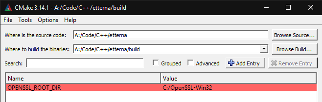
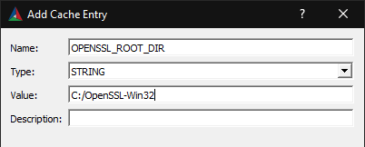
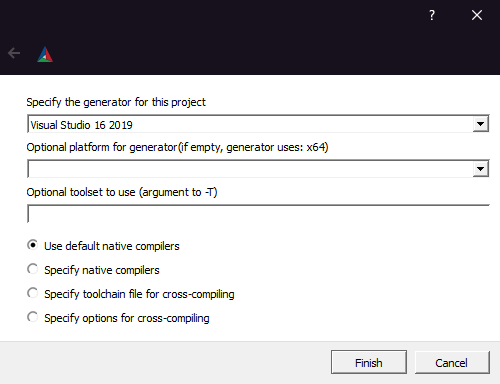

# Building Etterna

Interested in contributing to Etterna? This guide is the place to start!

## Table of Contents

- [Getting Started](#getting-started)
- [Quick Start](#quick-start)
- [Universal Dependencies](#universal-dependencies)
  - [Linux Dependencies](#linux-dependencies)
  - [Pop_OS! Notes](#pop_os-notes)
  - [Windows Dependencies](#windows-dependencies)
  - [macOS Dependencies](#macos-dependencies)
- [Project Generation](#project-generation)
  - [CLI Project Generation](#cli-project-generation)
  - [GUI Project Generation](#gui-project-generation)
- [Compiling](#compiling)
  - [Ninja](#ninja)
  - [Linux](#linux)
  - [macOS](#macos)
  - [Windows](#windows)
- [Distribution](#distribution)
- [Static Analysis](#static-analysis)
  - [cppcheck](#cppcheck)
- [Documentation](#documentation)
  - [C++](#c-docs)
  - [LDoc](#ldoc)

## Getting Started

To begin, take a look at what [dependencies](#universal-dependencies)
you're going to need to start compiling. Etterna is cross-platform on Linux, macOS, and Windows. Typically, we work off of the `develop` branch, therefore all pull requests should be made towards `develop`.

## Quick Start

Here are some commands for current developers and contributors to get started. More are listed at [Sample CMake Commands](#sample-cmake-commands).

```bash
cmake -G "Unix Makefiles" ..                                     # Linux
cmake -G "Visual Studio 16 2019" ..                              # Windows
cmake -DOPENSSL_ROOT_DIR="/usr/local/opt/openssl" -G "Xcode" ..  # macOS
```

## Universal Dependencies

- [CMake](https://cmake.org/download/) (Minimum version 3.14.0) - It is recommended to get this package from the CMake website as many package managers do not have the latest version. Check your package manager before trying.
- [OpenSSL](https://www.openssl.org/) (Version 1.1.1)
  - Debian: `apt install libssl-dev`
  - Fedora: `dnf install openssl-devel`
  - Arch: `pacman -S openssl`
  - Alpine: `apk add openssl-dev`
  - macOS: `brew install openssl`
  - Windows: A CMake compatible version of OpenSSL is available at [Shining Light Productions](https://slproweb.com/products/Win32OpenSSL.html) website. You will need the 32bit and 64bit installers if you plan on building both versions. It's recommended to uninstall old versions to make sure CMake can find the correct latest version. Direct links: [32bit](https://slproweb.com/download/Win32OpenSSL-1_1_1s.exe), [64bit](https://slproweb.com/download/Win64OpenSSL-1_1_1s.exe). If these links are dead, look for the OpenSSL v1.1.1 install links (EXE or MSI) on the Shining Light Productions site. Typically we use the full versions rather than the Light versions.
- [depot_tools](https://dev.chromium.org/developers/how-tos/install-depot-tools) - Installation is platform specific. To skip installing this, follow the relevant instructions in [CLI Project Generation](CLI-Project-Generation).

### Linux Dependencies

While most dependencies for macOS and Windows are included in the repo, there are some linux libraries which cannot be included in the repo.

For Pop_OS!, install the `Debian` dependencies, then refer to the [Pop_OS! Notes](#pop_os-notes) section below.

- Debian: `apt install build-essential libssl-dev libx11-dev libxrandr-dev libcurl4-openssl-dev libglu1-mesa-dev libpulse-dev libogg-dev libasound-dev libjack-dev`
- Fedora: `dnf install openssl-static libX11-devel libcurl-devel mesa-libGLU-devel libXrandr-devel libogg-devel pulseaudio-libs-devel alsa-lib-devel jack-audio-connection-kit-devel`
- Arch: `pacman -S openssl libx11 libxrandr curl mesa glu libogg pulseaudio jack`
- Alpine: `apk add build-base openssl-dev libx11-dev libxrandr-dev curl-dev mesa-dev glu-dev pulseaudio-dev libogg-dev alsa-lib-dev jack-dev`

### Pop_OS! Notes

More recent builds of Pop_OS! are missing some required dependencies.

#### Python 2.7

The build requires Python 2.7 be installed and symlinked as `python`.

Run `python --version`. If it's ok, skip this section. If `python --version` says `command not found`, run the following:

```bash
sudo apt install -y python2.7
sudo ln -s /usr/bin/python2.7 /usr/local/bin/python
```

#### clang

`clang` is required for Crashpad. If you don't want to include Crashpad, add `-DWITH_CRASHPAD=OFF` when running `cmake`. Otherwise, install `clang`:

```bash
sudo apt install -y clang
```

### Windows Dependencies

- [Visual Studio](https://visualstudio.microsoft.com/downloads/) - Any modern version of Visual Studio should be compatible _(The earliest version we theoretically support is `Visual Studio 9 2008`, though we have only tested on `Visual Studio 15 2017` and after)_
- [DirectX Runtimes](https://web.archive.org/web/20180112171750/http://www.microsoft.com/en-us/download/confirmation.aspx?id=8109) (June 2010)
- [DirectX SDK](https://web.archive.org/web/20180113160705if_/https://www.microsoft.com/en-us/download/confirmation.aspx?id=6812)
- [Microsoft Visual C++ Redistributables](http://www.microsoft.com/en-us/download/details.aspx?id=48145) - Both 32bit and 64bit
- [Windows 10 Development Kit](https://developer.microsoft.com/en-us/windows/downloads/windows-10-sdk)

### macOS Dependencies

- `YASM` or `NASM`. They can be installed with brew commands `brew install yasm` or `brew install nasm`. They are not directly used for Etterna, though is required for ffmpeg to be built from source.

## Project Generation

First, ensure you have forked Etterna, cloned to your system, and checked out `develop`.

There are two stages apart of CMake projects.

1. Configuration: CMake will run through all CMakeLists.txt and ensure all code processes.
2. Generation: CMake will take information from generation, and create the project files based on what was selected through the generation option.

### CLI Project Generation

Both configuration and generation stages automatically happen one after the other when using the CLI.
Start by creating a folder to hold all the output object files, usually called `build`, within the root of the project.

```bash
mkdir build && cd build
```

Etterna has game resources in the root of the project, so the output binary is either placed in the root of the project *(Unix)* or in the `Program` folder in the project root *(Windows)*.

To generate project files, you will only need to specify the `GENERATOR`. The `ARCHITECTURE` will assume 64bit if left undefined. If any trouble occurs with OpenSSL, the most likely answer will be to define where you have it installed through the `SSL_DIRECTORY` variable. If depot_tools is left uninstalled or misconfigured, you may be able to run `cmake` but the game will not compile. To get around this, build without Crashpad: Specify `-DWITH_CRASHPAD=OFF` in the `cmake` command.

- `SSL_DIRECTORY`: The root directory of your OpenSSL install. It may be required on macOS depending on the OpenSSL version which comes with your system _(thought we recommend getting the latest version from homebrew)_.
- `GENERATOR`: The generator you are choosing to use. Supported generators are listed below.
- `ARCHITECTURE`: The target architecture. Currently we support `Win32` and `x64`. This parameter is only necessary if using a Visual Studio generator. `x64` will automatically be selected if the variable is left empty.

```bash
cmake -DOPENSSL_ROOT_DIR="SSL_DIRECTORY" -G "GENERATOR" -A "ARCHITECTURE"  ..
```

Or to build without Crashpad:

```bash
cmake -DOPENSSL_ROOT_DIR="SSL_DIRECTORY" -DWITH_CRASHPAD=OFF -G "GENERATOR" -A "ARCHITECTURE"  ..
```

We actively support the following CMake generators

- macOS: `Ninja`, `Xcode`, `Unix Makefiles`
- Linux: `Ninja`, `Unix Makefiles`
- Windows: `Ninja`, `Visual Studio 16 2019`, `Visual Studio 17 2022`

For the `OPENSSL_ROOT_DIR` parameter, set the directory for where ever the openssl root directory is located. Here are possible options

- macOS: `/usr/local/opt/openssl` or otherwise depending on your setup (if you're using HomeBrew, MacPorts or installed in from source)
- Linux: This parameter is not necessary on linux. (CMake can find it on it's own)
- Windows: CMake writes files to find the version of OpenSSL linked above. If that version is installed, it should not be necessary to specify this variable (unless you have OpenSSL installed in a non-standard location, in which case, you should set OPENSSL_ROOT_DIR to that location)

Users building without Crashpad may choose to add the `-DWITH_CRASHPAD=OFF` option at the beginning of the command.

Users of Linux be aware that the game builds on the `Debug` target by default. Here are better alternatives:

- `-DCMAKE_BUILD_TYPE=Release` - Builds Release binary with no symbols, normal optimization.
- `-DCMAKE_BUILD_TYPE=RelWithDebInfo` - Builds Release binary with symbols, useful for debugging if any issues arise, almost same as Release otherwise.

#### Sample CMake Commands

**⚠️ Note**: You likely want to include `-DCMAKE_BUILD_TYPE=Release` when running `cmake`. This results in a smaller build that will often perform much better.

```bash
cmake -G "Ninja" ..                                                             # Linux Ninja
cmake -G "Unix Makefiles" ..                                                    # Linux Makefiles
cmake -G "Visual Studio 16 2019" -A Win32 ..                                    # 32bit Windows
cmake -G "Visual Studio 16 2019" -A x64 ..                                      # 64bit Windows
cmake -DOPENSSL_ROOT_DIR="/usr/local/opt/openssl" -G "Xcode" ..                 # macOS Xcode
cmake -DOPENSSL_ROOT_DIR="/usr/local/opt/openssl" -G "Ninja" ..                 # macOS Ninja
cmake -DOPENSSL_ROOT_DIR="/usr/local/opt/openssl" -G "Unix Makefiles" ..        # macOS Makefiles
cmake -DWITH_CRASHPAD=OFF -G "Visual Studio 16 2019" -A x64 ..                  # Without Crashpad - 64bit Windows
cmake -DCMAKE_BUILD_TYPE=Release -G "Ninja" ..                                  # Release Configuration - Linux Ninja
cmake -DCMAKE_BUILD_TYPE=RelWithDebInfo -G "Ninja" ..                           # Release + Debug Symbols - Linux Ninja
```

##### macOS Xcode Generation Note

When generating a project for Xcode, you may see errors stating `No CMAKE_{C,CXX}_COMPILER could be found.` Ensure that you have the Xcode command line tools installed. The command line tools can be installed with `xcodeselect --install`. You may also have to run `xcode-select --reset` to ensure the correct command line tools are apart of the system path.

### GUI Project Generation

In order to compile properly, you will want to make your CMake-GUI look similar to the photo below. The first text field is the location where you cloned Etterna, the second text field is where you want to place the build object files. If necessary,`OPENSSL_ROOT_DIR` can be added by clicking the add entry button. It should look similar to the following image.



**NOTE**: Setting `OPENSSL_ROOT_DIR` is unnecessary for linux users as CMake will find the location of OpenSSL on it's own.



**Windows Users**: If CMake was unable to find OpenSSL on it's own, remember to change the value correspond to the correct 32bit or 64bit version of the OpenSSL library.

Click the buttons labeled `Configure`. The first time this button is clicked (and a `CMakeCache.txt` does not exit in the build directory), CMake will ask about what generator you would like to use. If a Visual Studio generator is chosen, the `Optional platform for generator` will assume the 64bit option of `x64` if left empty. If building the 32bit version is required, click the drop down and select `Win32`. Once `Finish` is clicked, the project will begin configuring.



Finally, click `Generate`. An `Etterna.sln` file should appear in the build folder. Open it , and you are ready to start coding.

## Compiling

### Ninja

The ninja command used is exactly the same across all operating systems. It should be noted that Ninja can only build 64bit binaries ([unless you would like to compile Ninja yourself](https://github.com/ninja-build/ninja/issues/1339)).

To install ninja, use one of the following commands

- Debian: `apt install ninja-build`
- Fedora: `dnf install ninja-build`
- Arch: `pacman -S ninja`
- Alpine: `apk add samurai #As of 2021-11-10 ninja is not available in alpine main so use samurai instead`
- macOS: `brew install ninja`

To start compiling, run the cmake command with the Ninja generator, then run `ninja`.

### Linux

Run `make` or `ninja` corresponding to the CMake generator you used.

### macOS

#### Xcode Editor

Open the `Etterna.xcodeproj` file generated within the build directory, select the Etterna target, and you are ready to start coding.

#### Xcode CLI

```bash
xcodebuild -project Etterna.xcodeproj -configuration Release
```

Due to the extreme verbosity of `xcodebuild`, we recommend [xcpretty](https://github.com/xcpretty/xcpretty) to clean up the output.

### Windows

#### Visual Studio Editor

Open the `Etterna.sln` file generated within the build directory, and you are ready to start coding.

#### Visual Studio CLI

If you prefer the command line, these commands should be what you are looking for. Make sure you run the proper visual studio command prompt.

```bash
msbuild Etterna.sln /p:Platform="Win32" /p:Configuration="Release"  # Only for 32bit CMake generator
msbuild Etterna.sln /p:Platform="x64"   /p:Configuration="Release"  # Only for 64bit CMake generator
```

## Distribution

We use CMake's CPack module to build distribution files. Currently, we create distribution binaries for Windows and macOS.

**Windows only prerequisite**: Install the latest version of [Nullsoft Scriptable Install System](https://nsis.sourceforge.io/Main_Page)

To build a distribution file for the operating system you are using, run `cpack` in the build directory after compiling.

## Static Analysis

### cppcheck

cppcheck is a cross-platform static analysis tool which CMake supports by adding a target for it in your desired generator. The target named `cppcheck` will only be created if CMake can find the cppcheck command on your system.

- Debian: `apt install cppcheck`
- Fedora: `dnf install cppcheck`
- Arch: `pacman -S cppcheck`
- Alpine: `apk add cppcheck`
- macOS: `brew install cppcheck`
- Windows: An installer is available at the [cppcheck website](http://cppcheck.sourceforge.net/). Make sure that `cppcheck` runs when you enter the command in your CLI. If it doesn't, [check your system/user path](https://www.computerhope.com/issues/ch000549.htm) to ensure that the bin folder of where you installed cppcheck is listed there.

When cppcheck is run, it will generate a file in the build directory called `cppcheck.txt` which will have the output of the command. The output is saved to a file as the command produces significant output, and can take some time to run.

To run `cppcheck`, run the target. Running the target will be different depending on the generator you have chosen.

## Documentation

### C++ Docs

Etterna uses [Doxygen](http://www.doxygen.nl/) to build it's C++ documentation. Documentation is generated in a `doxygen` directory, inside the build directory. CMake is setup to make a target called `doxygen` if the executable found in the path.

- Debian: `apt install doxygen`
- Fedora: `dnf install doxygen`
- Arch: `pacman -S doxygen`
- Alpine: `apk add doxygen`
- macOS: `brew install doxygen`
- Windows: An installer is available at the [Doxygen website](http://www.doxygen.nl/download.html). As with [cppcheck](#cppcheck), make sure the executable binary directory is added to your path.

Doxygen within CMake is able to use [graphviz](https://www.graphviz.org/download/) to generate better looking relationship/hierarchy graphs. You can see how to download it for your operating system at the [graphgiz download page](https://www.graphviz.org/download/).

### LDoc

Etterna uses [LDoc](https://github.com/stevedonovan/LDoc) to generate Lua documentation. We reccomend installing [LuaRocks](https://github.com/luarocks/luarocks), and then installing LDoc through LuaRocks. Similar to Doxygen, it will only create the `ldoc` target if it can find the `ldoc` command in your system path.
