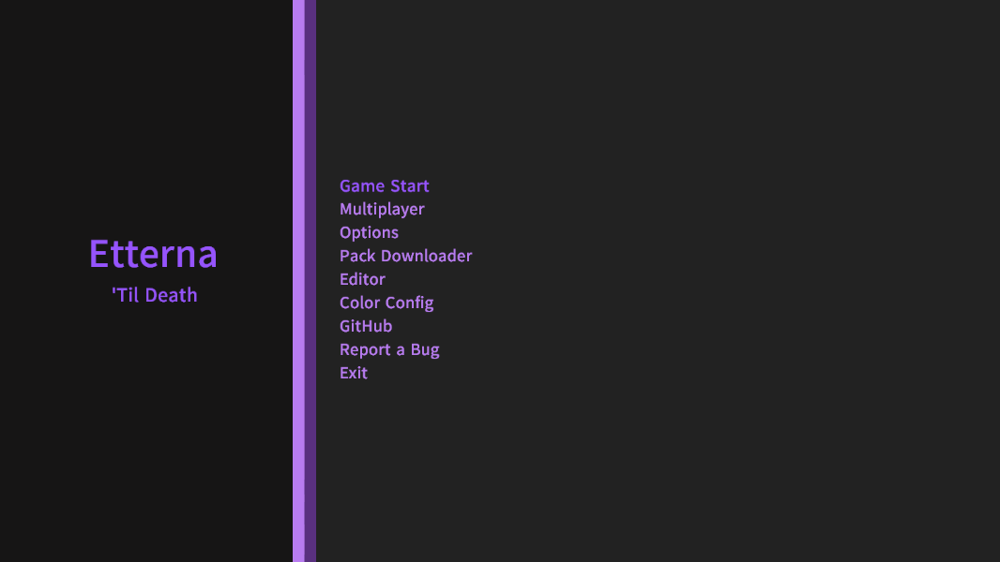

# Etterna

## Table of Contents

- [About Etterna](#About-Etterna)
- [Installing](#Installing)
  - [Windows and macOS](#Windows-and-macOS)
  - [Linux](#Linux)
- [Building](#Building)
- [Documentation](#Documentation)
- [Bug Reporting](#Bug-Reporting)
- [License](#License)

### About Etterna

Etterna is a cross-platform rhythm game similar to [Dance Dance Revolution](https://en.wikipedia.org/wiki/Dance_Dance_Revolution). It started as a fork of [StepMania 5](https://github.com/stepmania/stepmania), with the direction of focusing on keyboard players. Over time, Etterna evolved into it's own game, with in-game multiplayer, the online scoreboard [Etterna Online](https://etternaonline.com/), and a community of over 4,000 players.

### Installing

#### Windows and macOS

Head to the [Github Releases](https://github.com/etternagame/etterna/releases) page, and download the relevant file for your operating system. For Windows, run the installer, and you should be ready to go. For macOS, mount the DMG and copy the Etterna to a location of your choice. Run the executable, and you are ready to go.

#### Linux

Currently, the only supported way to play Etterna on a linux based operating system is to install from source. Please follow the instructions in [Building](Docs/Building.md) to get started.

### Documentation

Etterna uses Doxygen and LuaDoc. Both still need a lot of work before being having decent coverage, though we still have them hosted at the following links.  

- Latest CPP documentation: [https://etternagame.github.io/cpp-docs/](https://etternagame.github.io/cpp-docs/)
- Latest Lua documentation: [https://etternagame.github.io/lua-docs/](https://etternagame.github.io/lua-docs/)

### Bug Reporting

We use Github's issue tracker for all faults found in the game. If you would like to report a bug, please click the `Issues` tab at the top of this page, and use the `Bug report` template.

### Contributing

If you want to contribute to the Etterna client, please read [Building](Docs/Building.md) for instructions on how to get started. If you are more interested in helping with the in-game multiplayer, the nodejs server is hosted [here](https://github.com/etternagame/NodeMultiEtt). You will still need the Etterna client building and running on your system.

### License

Etterna uses the MIT License, as is required since we are derivative of StepMania 5. See [LICENSE](LICENSE) for more details.

In short, you are free to modify, sell, distribute, and sublicense this project. We ask that you include a reference to this github repository in your derivative, and do not hold us liable for something breaking.

Etterna uses the [MAD library](http://www.underbit.com/products/mad/) and [FFMPEG codecs](https://www.ffmpeg.org/). Those libraries, when built use the [GPL license](http://www.gnu.org).